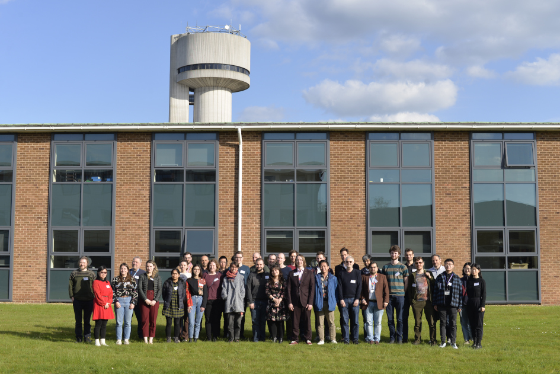
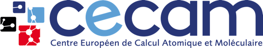
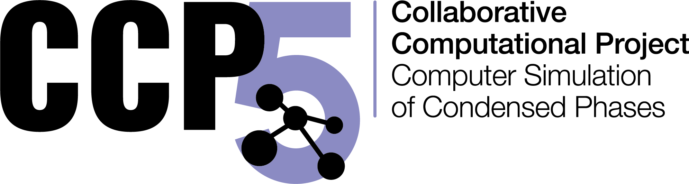
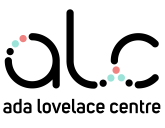

This page contains some information for attendees of the CECAM workshop "Open Science with the Atomic Simulation Environment" held at Daresbury Laboratory, UK from April 24-28 2023.

<figure>
  
  <figcaption>Workshop attendees at Daresbury Laboratory</figcaption>
</figure>

This is a CECAM Flagship Workshop: [CECAM event page](https://www.cecam.org/workshop-details/1245)

The event will consist of a science workshop with all attendees, followed by parallel sessions for tutorials and hackathon. Please check the relevant pages for information, depending which session(s) you plan to attend.

We are grateful for financial support from [CECAM](https://www.cecam.org), [Psi-k](https://psi-k.net), [CCP5](https://www.ccp5.ac.uk), [CCP9](https://ccp9.ac.uk), the [Ada Lovelace Centre](https://www.scd.stfc.ac.uk/Pages/Ada-Lovelace-Centre.aspx) and [PSDI](https://www.psdi.ac.uk).

<figure>

</figure>
<figure>

</figure>
